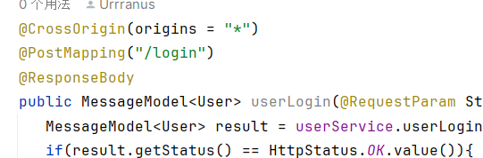
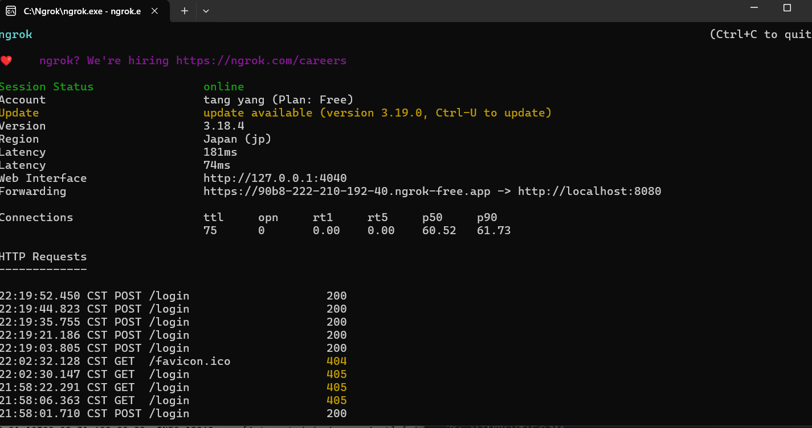
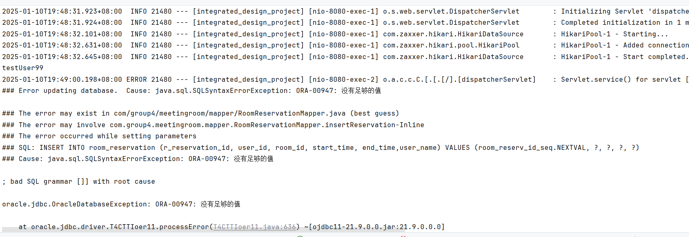

## 后端开发中遇到的问题

1.由于需求分析，与概要设计做的不够完善，开发小组对某个功能接口需要哪些参数，调用接口又应该返回哪些参数，以及参数应该以什么格式返回，理解不一致，导致前后端对接出现了严重的问题。

2.前后端开发成员经验不足，不知道对接流程

2.异常处理：后端开发中，不清楚某些函数可能会抛出哪些错误，以及错误该如何处理。try{} ，catch等语句不清楚怎么写

3.将项目部署到云服务器上，以及实现内网穿透，跨域请求时，遇到未知的bug

最初，没有加运行跨域访问的注解，导致前后端对接失败

用ngrok实现跨域请求

4.参数个数变化，但代码并没有改完，以致出现了bug。如，将预约信息插入到数据库中，参数个数不够，导致插入操作失败。

原因是

临时添加了user_name字段，但提供的参数仍只有5个

5.变量、参数命名混乱，降低了代码的可读性，增大了修改bug的难度

6.参数校验，应该对哪些参数做哪些校验，对于我来说，这是一个令人困扰的问题。

7.尝试将项目部署到云服务器上

遇到的困难：不知道如何在linux系统上配置java环境，以及如何在Linux系统上配置Oracle数据库